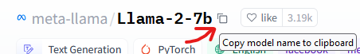
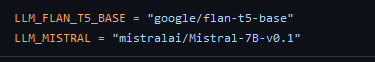
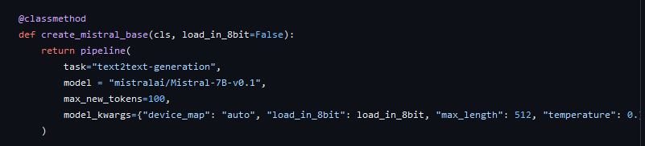

__Comment rajouter un model__ :

Premierement copier le lien du model sur Huggingface que vous trouverez ici ->  ](<images/huggingface.png>)

Ensuite mettez votre lien dans le fichier constant en le nommant comment vous le souhaiter -> ](<images/constant.png>)

Dans le fichier Txt_qa.py rajouter une fonction comme celle si comprenant votre model -> ](<images/methode.png>)

Dans le fichier streamlit_app_blog.py rajouter un elif avec votre model dans la fonction load_llm -> 

Rajouter votre model dans le bouton -> 

__Enjoy__

